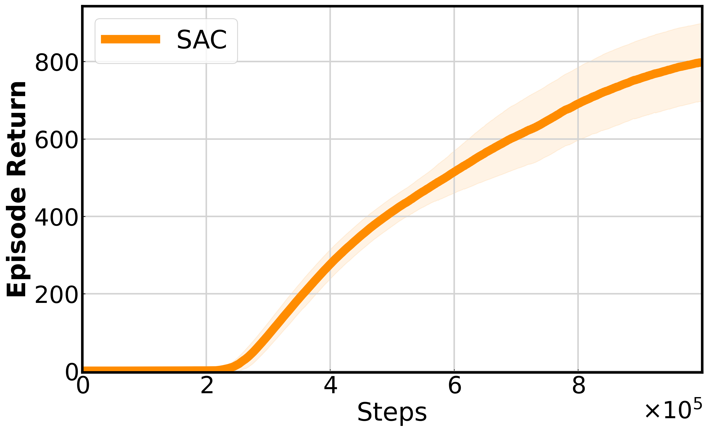
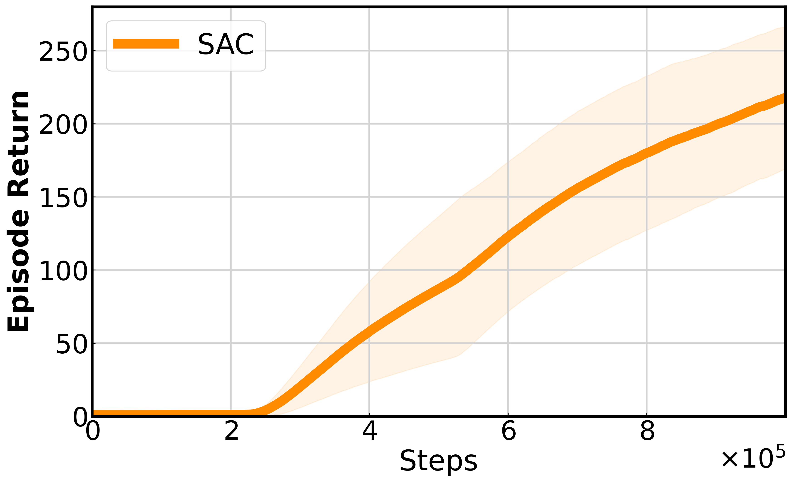
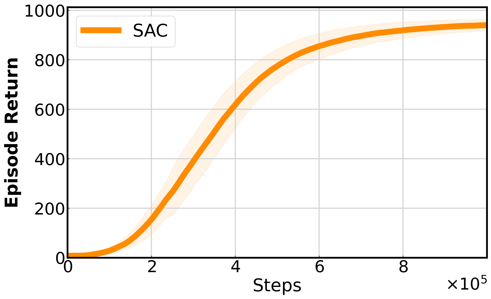
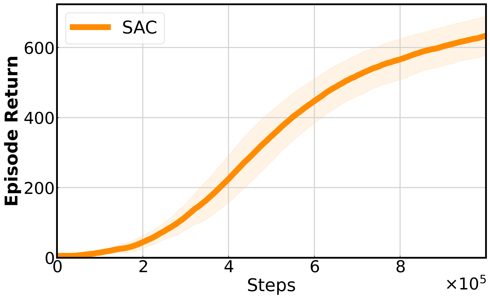

# CleanRL-JAX

A deep reinforcement learning library implemented with Flax/NNX, inspired by [CleanRL](https://github.com/vwxyzjn/cleanrl)'s design philosophy and integrated with the latest [SimBa architecture](https://arxiv.org/abs/2410.09754).

## 📊 Training Results

<div align="center">

<p><strong>Humanoid Walk</strong></p>


<p><strong>Humanoid Run</strong></p>


<p><strong>Dog Walk</strong></p>


<p><strong>Dog Run</strong></p>


<p><em>Training performance curves showing the effectiveness of SimBa architecture on various continuous control tasks</em></p>

</div>

## 🌟 Key Features

### SimBa Architecture Integration
This project fully implements the **SimBa: Simplicity Bias for Scaling Up Parameters in Deep Reinforcement Learning** architecture published by Sony Research:

- **Observation Normalization Layer**: Standardizes inputs using running statistics, based on official Welford algorithm implementation
- **Residual Feedforward Block**: LayerNorm + 4x expansion FFN + residual connection, providing linear pathways to avoid overfitting
- **Layer Normalization**: Controls feature magnitudes and enhances training stability

### Supported Algorithms
- **SAC (Soft Actor-Critic)** - Continuous control algorithm with SimBa architecture
- **TD3 (Twin Delayed DDPG)** - Deterministic policy gradient algorithm with SimBa architecture

### Advanced Features
- ✅ **Prioritized Experience Replay**
- ✅ **Linear Decay Sampling**
- ✅ **Observation Normalization**
- ✅ **Gradient Monitoring**
- ✅ **Configurable Network Architecture** (MLP vs Residual blocks)

## 🚀 Quick Start

### Requirements
```bash
pip install -r requirements.txt
```

### Training SAC Agent
```bash
# Basic training
python train_sac.py --env-id dmc-humanoid-walk

# Using SimBa residual architecture
python train_sac.py \
    --env-id dmc-humanoid-walk \
    --actor-block-type residual \
    --actor-num-blocks 1 \
    --critic-block-type residual \
    --critic-num-blocks 2

# Enable prioritized experience replay
python train_sac.py \
    --env-id dmc-humanoid-walk \
    --prioritized-replay True
```

### Training TD3 Agent
```bash
# Basic training
python train_td3.py --env-id dmc-cheetah-run

# Custom architecture parameters
python train_td3.py \
    --env-id dmc-cheetah-run \
    --actor-hidden-dim 256 \
    --critic-hidden-dim 512 \
    --actor-num-blocks 1 \
    --critic-num-blocks 2
```

## 🏗️ Project Structure

```
cleanrl_jax/
├── agents/
│   ├── sac/                    # SAC algorithm implementation
│   │   ├── sac_leaner.py      # SAC learner
│   │   ├── network.py         # Network architecture
│   │   └── update.py          # Update logic
│   └── td3/                   # TD3 algorithm implementation
│       ├── td3_leaner.py      # TD3 learner
│       └── network.py         # Network architecture
|       |__ update.py          # Update logic
├── utils/
│   ├── SimBa.py              # SimBa architecture implementation ⭐
│   ├── Normalization.py      # Observation normalization
│   ├── ReplayBuffer.py       # Experience replay buffer
│   ├── PrioritizedReplayBuffer.py  # Prioritized replay
│   ├── grad_monitor.py       # Gradient monitoring
│   ├── logger.py            # Logging utilities
│   └── dmc_wrapper.py       # DeepMind Control environment wrapper
train_sac.py                 # SAC training script
train_td3.py                 # TD3 training script
requirements.txt             # Dependencies list
```

## 🧠 SimBa Architecture 

### Core Design Philosophy
SimBa introduces **simplicity bias** to scale up network parameters in deep reinforcement learning while avoiding overfitting:

```python
class ResidualBlock(nnx.Module):
    """SimBa residual block implementation"""
    def __call__(self, x: jnp.ndarray) -> jnp.ndarray:
        residual = x
        # Pre-norm residual block
        x = self.layer_norm(x)
        x = self.dense1(x)  # hidden_dim -> hidden_dim * 4
        x = nnx.relu(x)
        x = self.dense2(x)  # hidden_dim * 4 -> hidden_dim
        # Residual connection
        return residual + x
```

### Architecture Comparison
| Component | Traditional MLP | SimBa Architecture |
|-----------|-----------------|-------------------|
| Normalization | None | Running statistics normalization |
| Network Structure | Simple feedforward | Residual feedforward blocks |
| Feature Control | None | LayerNorm |
| Parameter Scaling | Linear growth | Simplicity bias scaling |

## 📊 Performance

SAC with SimBa architecture achieves SOTA performance on multiple continuous control tasks:

- **DMC Suite**: Significant improvements on Humanoid, Cheetah, and other tasks
- **MyoSuite**: Excellent performance on musculoskeletal control tasks
- **HumanoidBench**: Complex humanoid robot control


## 📚 References

### SimBa Paper
```bibtex
@inproceedings{
    lee2025simba,
    title={SimBa: Simplicity Bias for Scaling Up Parameters in Deep Reinforcement Learning},
    author={Hojoon Lee and Dongyoon Hwang and Donghu Kim and Hyunseung Kim and Jun Jet Tai and Kaushik Subramanian and Peter R. Wurman and Jaegul Choo and Peter Stone and Takuma Seno},
    booktitle={The Thirteenth International Conference on Learning Representations},
    year={2025},
    url={https://openreview.net/forum?id=jXLiDKsuDo}
}
```

### Related Projects
- [CleanRL](https://github.com/vwxyzjn/cleanrl) - Original CleanRL project
- [SimBa Official Implementation](https://github.com/SonyResearch/simba) - Sony Research official code
- [JAX](https://github.com/google/jax) - Google JAX framework
- [Flax](https://github.com/google/flax) - Neural network library


## 🙏 Acknowledgments

- Thanks to the [CleanRL](https://github.com/vwxyzjn/cleanrl) project for design inspiration
- Thanks to Sony Research team for open-sourcing the SimBa architecture
- Thanks to JAX/Flax teams for providing excellent deep learning frameworks
